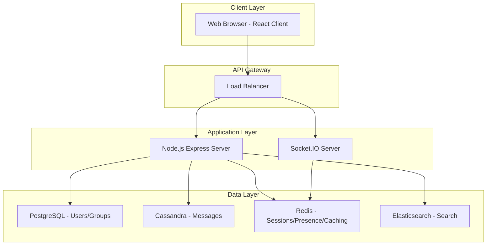

# OmegaChat Architecture

## System Overview

OmegaChat is a real-time web chat application designed with scalability, security, and performance in mind. The architecture follows a microservices pattern with a monorepo structure for ease of development and deployment.



## Tech Stack

### Frontend
- **Framework**: React 19 with Hooks
- **Language**: TypeScript
- **State Management**: Zustand
- **Styling**: Tailwind CSS
- **Real-time Communication**: Socket.IO Client
- **Performance Optimization**: react-virtuoso for virtualized lists
- **Security**: Libsignal-protocol-javascript (simulated)

### Backend
- **Runtime**: Node.js
- **Framework**: Express
- **Language**: TypeScript
- **Real-time Engine**: Socket.IO with Redis Adapter
- **Primary Database**: PostgreSQL (Users, Relationships, Group Membership)
- **Messaging Database**: Cassandra (Chat Logs with TimeUUID)
- **Caching/Presence**: Redis (Pub/Sub, Bitmaps)
- **Search**: Elasticsearch (future implementation)
- **Authentication**: JWT

## Folder Structure

```
omegachat/
├── client/
│   ├── src/
│   │   ├── features/
│   │   │   ├── auth/
│   │   │   └── chat/
│   │   ├── components/
│   │   ├── hooks/
│   │   ├── stores/
│   │   ├── services/
│   │   ├── utils/
│   │   ├── assets/
│   │   └── types/
│   ├── public/
│   └── package.json
├── server/
│   ├── src/
│   │   ├── controllers/
│   │   ├── models/
│   │   ├── routes/
│   │   ├── services/
│   │   ├── middleware/
│   │   ├── utils/
│   │   ├── config/
│   │   ├── migrations/
│   │   └── cassandra/
│   └── package.json
├── package.json
└── README.md
```

## Database Design

### PostgreSQL Schema

#### Users Table
Stores user account information:
- id (SERIAL PRIMARY KEY)
- username (VARCHAR, UNIQUE)
- email (VARCHAR, UNIQUE)
- password_hash (VARCHAR)
- phone_number (VARCHAR, UNIQUE)
- display_name (VARCHAR)
- profile_picture_url (TEXT)
- status (TEXT)
- last_seen (TIMESTAMP)
- created_at (TIMESTAMP)
- updated_at (TIMESTAMP)

#### Groups Table
Stores group chat information:
- id (SERIAL PRIMARY KEY)
- name (VARCHAR)
- description (TEXT)
- avatar_url (TEXT)
- created_by (INTEGER REFERENCES users)
- created_at (TIMESTAMP)
- updated_at (TIMESTAMP)

#### User_Groups Table
Many-to-many relationship between users and groups:
- id (SERIAL PRIMARY KEY)
- user_id (INTEGER REFERENCES users)
- group_id (INTEGER REFERENCES groups)
- role (VARCHAR)
- joined_at (TIMESTAMP)

#### Friendships Table
Tracks user relationships:
- id (SERIAL PRIMARY KEY)
- requester_id (INTEGER REFERENCES users)
- addressee_id (INTEGER REFERENCES users)
- status (VARCHAR)
- created_at (TIMESTAMP)
- updated_at (TIMESTAMP)

### Cassandra Schema

#### Messages Table
Partitioned by conversation_id for efficient retrieval:
- conversation_id (UUID, PARTITION KEY)
- message_id (TIMEUUID, CLUSTERING COLUMN)
- sender_id (INT)
- recipient_id (INT)
- content (TEXT)
- media_urls (LIST<TEXT>)
- message_type (VARCHAR)
- status (VARCHAR)
- timestamp (TIMESTAMP)
- edited (BOOLEAN)
- edited_timestamp (TIMESTAMP)
- deleted (BOOLEAN)
- metadata (MAP<TEXT, TEXT>)

#### Conversations Table
Stores conversation metadata:
- conversation_id (UUID, PRIMARY KEY)
- participants (SET<INT>)
- conversation_type (VARCHAR)
- name (VARCHAR)
- avatar_url (TEXT)
- created_at (TIMESTAMP)
- updated_at (TIMESTAMP)

#### User_Conversations Table
User-specific conversation settings:
- user_id (INT, PARTITION KEY)
- conversation_id (UUID, CLUSTERING COLUMN)
- unread_count (INT)
- last_read_message_id (TIMEUUID)
- muted (BOOLEAN)
- archived (BOOLEAN)
- pinned (BOOLEAN)

### Redis Schema

#### Presence Management
Using bitmaps for efficient presence tracking:
- presence_bitmap: Bitmap where each bit represents a user's online status
- session:#session_id: User session mapping
- room:#room_id: Set of users in a room

## Security Implementation

### Authentication Flow
1. User registers with username/email/password
2. Password is hashed with bcrypt
3. JWT token is generated upon successful login
4. Token is stored in localStorage on client
5. Token is verified on protected routes

### Signal Protocol Simulation
Implementation of end-to-end encryption concepts:
1. Identity Key generation
2. PreKey Bundle publication
3. Session establishment (X3DH)

## Real-time Communication

### Socket.IO Events

#### Connection Events
- `connection`: User connects to server
- `disconnect`: User disconnects from server

#### Room Events
- `join_room`: User joins a chat room
- `leave_room`: User leaves a chat room
- `user_joined`: Notification when user joins room
- `user_left`: Notification when user leaves room

#### Message Events
- `send_message`: Client sends message to server
- `receive_message`: Server broadcasts message to room
- `typing`: User typing indicator

## API Endpoints

### Authentication
- `POST /api/auth/register`: Register new user
- `POST /api/auth/login`: Login existing user

### Link Preview
- `POST /api/preview`: Generate preview for URL

## Architectural Justification

### Scalability
1. **Microservices Pattern**: Separation of concerns allows independent scaling of components
2. **Database Sharding**: Cassandra's partitioning by conversation_id enables horizontal scaling
3. **Redis Adapter**: Socket.IO with Redis allows multiple server instances to share events
4. **Caching Layer**: Redis reduces database load for frequent operations

### Performance
1. **Virtualization**: react-virtuoso efficiently renders large message lists
2. **Database Selection**: PostgreSQL for relational data, Cassandra for time-series messages
3. **Caching Strategy**: Redis for session storage and presence tracking
4. **Connection Reuse**: Socket.IO's persistent connections reduce handshake overhead

### Security
1. **JWT Authentication**: Stateless authentication that scales well
2. **Signal Protocol**: End-to-end encryption simulation for message privacy
3. **Input Validation**: Server-side validation prevents injection attacks
4. **Rate Limiting**: Future implementation to prevent abuse

### Maintainability
1. **Monorepo Structure**: Shared configuration and easier dependency management
2. **Feature-based Organization**: Clear separation of application features
3. **Service Layer**: Abstraction of business logic from controllers
4. **Type Safety**: TypeScript ensures code quality and reduces runtime errors

This architecture provides a solid foundation for a scalable, secure, and performant real-time chat application that can grow with user demand.